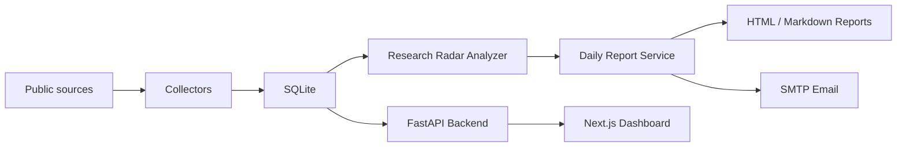

# Research Radar Hub

Research Radar Hub is a local-first research intelligence dashboard and email digest system. It collects public research metadata from arXiv, GitHub, official course pages, security feeds, and selected web sources, then turns the results into topic-focused daily research reports.

The project is designed for people who want a personal research radar that runs on their own machine: no cloud database, no hosted worker, and no required LLM key. Docker Compose is the recommended way to run it.

[](https://github.com/wangyufanshuai/research-radar-hub/actions/workflows/ci.yml)
[](LICENSE)

## What It Does

Research Radar Hub collects and organizes public signals from:

- arXiv papers
- GitHub public repositories
- NASA NTRS/TechPort public research and technology metadata
- official course pages such as MIT OCW, ETH Zurich, and Cambridge
- Hacker News stories
- CVE/NVD/CISA security metadata
- configurable public website change checks

It stores metadata in SQLite, exposes a FastAPI backend, serves a Next.js dashboard, and can send daily research emails through SMTP.

The first built-in radar topics are:

- GR/QFT
- AI for Engineering
- CAE
- Robotics
- Cybersecurity

## Screenshots

Screenshots are intentionally left out of the first source release. After running locally, open the dashboard and add your own screenshots under a future `docs/assets/` directory if desired.

## Features

- **Daily research radar**: grouped Markdown/HTML reports with papers, repositories, and courses.
- **AI Scientist Workspace**: staged topic research workflow with novelty scoring, reading routes, and reproduction plans.
- **Paper Understanding**: safe metadata-first extraction of formulas, datasets, code links, metrics, and citation clues.
- **NASA source pack**: NASA NTRS public metadata by default, with optional TechPort and ADS integration.
- **arXiv collector**: category-based public API collection with polite request sizes and delays.
- **GitHub collector**: public Search REST API collection with optional `GITHUB_PAT` for higher rate limits.
- **Course radar**: low-frequency collection from official public course pages and RSS/HTML sources.
- **Email delivery**: SMTP-based report delivery for Gmail, QQ Mail, Outlook, or self-hosted SMTP.
- **Optional LLM summaries**: OpenAI-compatible chat completions for Chinese summaries and recommendation reasons.
- **Fallback summaries**: works without an LLM key using rule-based summaries.
- **Local-first storage**: SQLite, local cache, local report output.
- **Docker Compose**: one command starts backend and frontend.
- **CI-ready**: GitHub Actions runs backend tests and repository command checks.

## Architecture



Main components:

- `backend/collectors/`: arXiv, GitHub, NASA, course, HN, CVE, and website collectors.
- `backend/models/`: SQLAlchemy models.
- `backend/services/`: collection orchestration, report generation, email delivery, paper understanding, and research radar analysis.
- `backend/api/`: FastAPI routes and response schemas.
- `frontend/`: Next.js dashboard.
- `tests/`: pytest coverage for repositories, collectors, API routes, and research radar behavior.

## Quick Start With Docker

Prerequisites:

- Docker Desktop
- Git
- A terminal such as PowerShell, Windows Terminal, or Bash

Clone and run:

```bash
git clone https://github.com/wangyufanshuai/research-radar-hub.git
cd research-radar-hub
cp .env.example .env
docker compose up --build
```

Open:

- Dashboard: <http://localhost:3000>
- Research Radar page: <http://localhost:3000/radar>
- AI Scientist page: <http://localhost:3000/scientist>
- Backend API docs: <http://localhost:8001/docs>
- Backend health check: <http://localhost:8001/api/v1/health>

Docker storage behavior:

- SQLite database: Docker named volume `research-radar-hub_backend-data`
- Cache files: local `cache/`
- Generated HTML reports: local `reports/`

The named volume avoids common SQLite file locking and disk I/O problems on Windows bind mounts.

## Configuration

Copy `.env.example` to `.env` and fill only the values you need.

```env
GITHUB_PAT=
ADS_API_TOKEN=
TECHPORT_API_TOKEN=

OPENAI_API_KEY=
OPENAI_BASE_URL=https://api.openai.com/v1
OPENAI_MODEL=gpt-4o-mini

SMTP_HOST=
SMTP_PORT=587
SMTP_USER=
SMTP_PASSWORD=
EMAIL_FROM=
EMAIL_TO=

NEXT_PUBLIC_API_PROXY_BASE=http://backend:8000
```

Secrets:

- `GITHUB_PAT`: optional. Raises GitHub public API rate limits. No special scopes are required for public repository search.
- `ADS_API_TOKEN`: optional. Enables SAO/NASA ADS literature search when `ads.enabled=true`.
- `TECHPORT_API_TOKEN`: optional. Enables NASA TechPort when `nasa.techport.enabled=true`.
- `OPENAI_API_KEY`: optional. Enables LLM summaries.
- `OPENAI_BASE_URL`: optional. Use this for OpenAI-compatible providers such as SiliconFlow.
- `OPENAI_MODEL`: optional. Model name for report summarization.
- SMTP values: optional unless you want email delivery.

Public runtime configuration lives in `config.yaml`:

- arXiv categories and max results
- GitHub languages, star threshold, and max results
- course sources and selectors
- Research Radar topics and keywords
- report lookback window
- LLM item budget per report
- rate limits and retry behavior

## SMTP Email Setup

Research Radar Hub sends email through standard SMTP. It does not use a third-party email API.

Example QQ Mail configuration:

```env
SMTP_HOST=smtp.qq.com
SMTP_PORT=587
SMTP_USER=your-address@qq.com
SMTP_PASSWORD=your-smtp-authorization-code
EMAIL_FROM=your-address@qq.com
EMAIL_TO=your-address@qq.com
```

For QQ Mail, `SMTP_PASSWORD` must be the SMTP authorization code from QQ Mail settings, not your QQ login password.

Example Gmail configuration:

```env
SMTP_HOST=smtp.gmail.com
SMTP_PORT=587
SMTP_USER=your-address@gmail.com
SMTP_PASSWORD=your-google-app-password
EMAIL_FROM=your-address@gmail.com
EMAIL_TO=target@example.com
```

For Gmail, enable 2-Step Verification and create an App Password.

## Local Development

Backend:

```powershell
python -m venv backend/venv
backend\venv\Scripts\Activate.ps1
pip install -r backend\requirements.txt
pytest tests -q
uvicorn backend.main:app --reload --port 8000
```

Frontend:

```powershell
cd frontend
npm install
npm run dev
```

When running the frontend outside Docker, set:

```env
NEXT_PUBLIC_API_PROXY_BASE=http://localhost:8000
```

Then open <http://localhost:3000>.

## Common Commands

Collect one source:

```bash
python -m backend.scripts.collect --source arxiv --incremental
python -m backend.scripts.collect --source github --incremental
python -m backend.scripts.collect --source course --incremental
python -m backend.scripts.collect --source nasa --incremental
```

Collect every registered source:

```bash
python -m backend.scripts.collect --source all --incremental
```

Generate a Research Radar report:

```bash
python -m backend.scripts.research_radar --collect
```

Generate and send a Research Radar email:

```bash
python -m backend.scripts.research_radar --collect --send
```

Run an AI Scientist topic workspace:

```bash
python -m backend.scripts.ai_scientist --topic "neural operator for relativistic hydrodynamics" --run
```

Analyze recent papers and NASA items without executing any external code:

```bash
python -m backend.scripts.paper_understanding --limit 20
```

Docker API examples:

```bash
curl -X POST "http://localhost:8001/api/v1/collect/arxiv?incremental=false"
curl -X POST "http://localhost:8001/api/v1/collect/github?incremental=false"
curl -X POST "http://localhost:8001/api/v1/collect/course?incremental=false"
curl -X POST "http://localhost:8001/api/v1/collect/nasa?incremental=false"
curl "http://localhost:8001/api/v1/reports/daily?kind=research&refresh=true"
curl -X POST "http://localhost:8001/api/v1/reports/daily/send?kind=research&refresh=false"
curl -X POST "http://localhost:8001/api/v1/papers/1/understanding?allow_pdf=false"
```

## API Overview

Useful endpoints:

- `GET /api/v1/health`
- `POST /api/v1/collect/{source}`
- `GET /api/v1/papers`
- `POST /api/v1/papers/{id}/understanding`
- `GET /api/v1/repos`
- `GET /api/v1/stories`
- `GET /api/v1/radar/courses`
- `GET /api/v1/reports/daily?kind=research&refresh=true`
- `POST /api/v1/reports/daily/send?kind=research`
- `POST /api/v1/scientist/tasks`
- `POST /api/v1/scientist/tasks/{task_id}/run`
- `GET /api/v1/scientist/tasks/{task_id}`
- `GET /api/v1/scientist/tasks/{task_id}/report`

Supported collection sources include:

- `arxiv`
- `github`
- `hn`
- `course`
- `nasa`
- `school`
- `cve`
- `website`
- `all`

## Daily Automation On Windows

For a local daily email, create a Windows Task Scheduler task.

Program:

```text
powershell.exe
```

Arguments:

```powershell
-NoProfile -ExecutionPolicy Bypass -Command "cd E:\path\to\research-radar-hub; backend\venv\Scripts\python.exe -m backend.scripts.research_radar --collect --send"
```

Recommended schedule:

- Once per day in the morning.
- Run only when the network is available.
- Keep logs enabled in Task Scheduler history.

If you use Docker instead of a local Python virtual environment, schedule:

```powershell
cd E:\path\to\research-radar-hub
docker compose exec -T backend python -m backend.scripts.research_radar --collect --send
```

## Data Sources

| Source | Purpose | Auth | Notes |
| --- | --- | --- | --- |
| arXiv | Papers | No | Uses the public arXiv API with small page sizes. |
| GitHub | Repositories | Optional PAT | Uses public Search REST API. |
| NASA NTRS | Research metadata | No | Uses public NASA STI/NTRS metadata and links. |
| NASA TechPort | Technology projects | Optional token | Disabled by default unless configured. |
| SAO/NASA ADS | Literature metadata | Optional token | Disabled by default unless configured. |
| MIT OCW | Courses | No | Uses official public pages where accessible. |
| ETH Zurich | Courses | No | Respects robots.txt; inaccessible pages are skipped. |
| Cambridge | Courses | No | Uses official public course pages. |
| Hacker News | Tech stories | No | Uses public endpoints. |
| NVD/CISA KEV | Security metadata | No | Uses public vulnerability metadata. |
| Website changes | Page monitoring | No | Respects robots.txt by default. |

## Compliance Boundary

Research Radar Hub is intentionally conservative:

- Collects public metadata and public page snippets only.
- Does not bypass login walls, paywalls, CAPTCHA, or access controls.
- Does not download course PDFs, videos, or lecture files.
- Paper PDF extraction is disabled by default and, when enabled, is limited by size, page count, timeout, and public URLs only.
- Respects robots.txt for HTML/page sources by default.
- Uses rate limits and retry controls in `config.yaml`.
- Stores all runtime data locally.

## Testing

Run backend tests:

```bash
pytest tests -q
```

Build frontend:

```bash
cd frontend
npm run build
```

Build Docker images:

```bash
docker compose build
```

Full local smoke test:

```bash
docker compose up -d --build
curl http://localhost:8001/api/v1/health
curl -X POST "http://localhost:8001/api/v1/collect/arxiv?incremental=false"
curl "http://localhost:8001/api/v1/reports/daily?kind=research&refresh=true"
```

## Troubleshooting

### GitHub collection is rate-limited

Add a `GITHUB_PAT` to `.env`. Public repository search works without a token, but unauthenticated limits are low.

### arXiv returns 429 or 503

arXiv sometimes rate-limits public API traffic. Lower `arxiv.max_results_per_query`, increase `arxiv.rate_limit.request_delay_seconds`, and retry later.

### Report generation is slow

LLM summaries are optional and can be expensive. Lower:

```yaml
research_radar:
  llm_max_items_per_report: 2
```

Set `OPENAI_API_KEY=` empty to disable LLM summaries entirely.

### QQ Mail does not send

Use the QQ SMTP authorization code, not the account password. Check that SMTP is enabled in QQ Mail settings.

### Docker on Windows reports SQLite disk I/O errors

The Compose file stores SQLite in a Docker named volume instead of a Windows bind mount. Avoid manually remapping `/app/data` to a Windows folder unless you know the locking behavior is safe.

## Security Notes

- Never commit `.env`.
- Rotate any API key or SMTP password that has been pasted into chat, logs, screenshots, or issue comments.
- Keep `OPENAI_API_KEY`, `GITHUB_PAT`, and SMTP credentials in environment variables only.
- Keep `ADS_API_TOKEN` and `TECHPORT_API_TOKEN` in environment variables only.
- Generated reports may contain private reading interests; `reports/` is ignored by git.
- SQLite databases, cache files, and virtual environments are ignored by git.

## Project Layout

```text
backend/        FastAPI app, collectors, models, repositories, scripts
frontend/       Next.js dashboard
tests/          pytest suite
docs/           deployment, data-source, and roadmap docs
config.yaml     public runtime configuration
.env.example    local secret template
docker-compose.yml
```

## Roadmap

Near-term:

- richer Research Radar dashboard filters
- richer Paper Understanding with citation graph scoring
- NASA source normalization and ADS search presets
- digest preview before sending
- export to Markdown and JSON

Later:

- personal knowledge graph
- safe reviewed experiment notebooks
- GitHub Actions scheduled digests
- Zotero or reference-manager integration
- multi-user deployment mode

## Contributing

Issues and pull requests are welcome. Please read `CONTRIBUTING.md` and keep new collectors conservative: public data only, clear source attribution, rate limits, and tests.

## License

MIT. See `LICENSE`.
